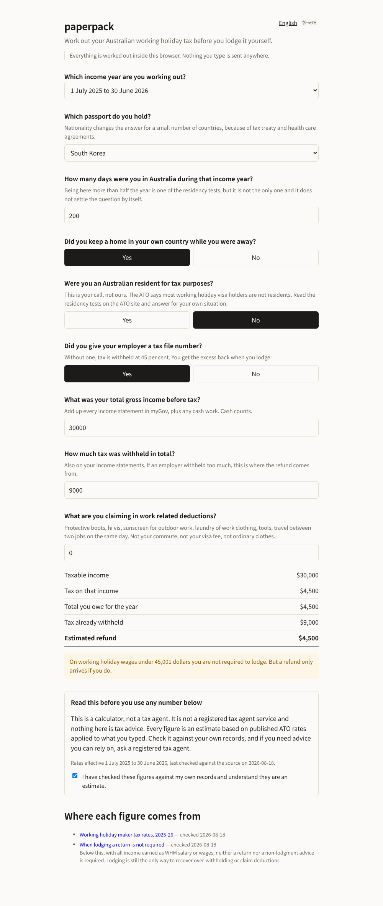

# paperpack

Answer a set of questions, get the filled paperwork back. Runs entirely in the browser.



The first pack works out Australian working holiday maker tax. Around 211,000 people
hold a 417 or 462 visa at any time, most of them are taxed from the first dollar with
no tax free threshold, and a lot of them are over-withheld by an employer who never
registered as a working holiday employer. That money only comes back if you lodge.

## What it does

- Works out the tax on working holiday income for 2025-26 and 2026-27
- Shows what you already had withheld and what the difference is
- Warns you where nationality changes the answer, which it does for eight treaty
  countries and eleven reciprocal health care countries
- Runs the *Addy* comparison for a resident of a treaty country: it works out the tax
  both as a working holiday maker and as a resident Australian national, shows both, and
  applies the cheaper one, which is what the treaty actually gives you
- Prints every figure with the ATO page it came from and the date that page was checked
- Speaks English and Korean

## What it does not do

- It does not lodge anything. Lodging goes through myTax, in your own hands.
- It does not assume the resident basis wins. The treaty gives you the lower of two
  assessments, not resident rates, and both are on screen.
- It does not handle income earned outside Australia. That income counts on one side of
  the comparison and not the other, so the tool says so rather than quietly getting it
  wrong.
- It does not estimate a resident's 2026-27 tax until the ATO publishes that year's
  Medicare levy thresholds. Refusing a year is better than guessing at it.
- It does not model deduction rules it has not read. From 2026-27 the 300 dollar
  no-receipts allowance is repealed and a 1,000 dollar standard deduction replaces it for
  residents only, so the two years behave differently on purpose.
- It is not a tax agent service and nothing in it is tax advice. It applies published
  rates to numbers you typed. Check them, and if you need advice you can rely on, ask a
  registered tax agent. See [docs/legal.md](docs/legal.md).

## Run it

```
pnpm install
pnpm build
npx http-server . -p 8080     # or any static server
```

Then open `/web/index.html`. There is no backend and nothing to configure. What you
type stays in the tab.

## How the rules are stored

Every regulatory number lives in `packs/<pack>/rules/*.json`, and none of them ship
without provenance:

```json
"noTfnWithholdingRate": {
  "value": 0.45,
  "from": "2025-07-01",
  "source": "https://www.ato.gov.au/tax-rates-and-codes/schedule-15-tax-table-for-working-holiday-makers",
  "checked": "2026-08-18",
  "note": "45 per cent, not 47. The extra 2 per cent Medicare component belongs to the resident no-TFN rate and WHMs sit outside it."
}
```

`scripts/check.mjs` rejects any rule missing `value`, `from`, `source` or `checked`, and
the test suite asserts that each band table's base amounts agree with the table below
them, which is how a mistyped rate gets caught before anyone sees a wrong number.

Australian tax rates change on 1 July. Re-check the sources before then.

## Adding a language

Copy `packs/au-whm-tax/i18n/en.json`, translate the values, keep the keys. The tests
fail if a key is missing, empty, or if the calculator can raise a message the
translation does not carry. Tax wording is easy to get wrong in translation, so keep
the source link visible next to anything you translate.

## Adding a pack

A pack is an interview (`interview.ts`), a calculation (`calculate.ts`), rule data with
sources (`rules/*.json`) and strings (`i18n/*.json`). The engine in `src/` has no
knowledge of Australia or of tax.

## License

MIT.
